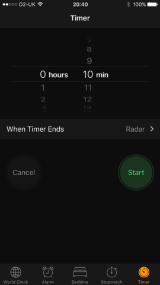

# Stopwatch

A clone of the iOS Timer application build using React Native.

## Getting Started

### Prerequisites

Installing Create-React-Native-App and the latest versions of NPM and Node.

```
$ npm i -g create-react-native-app@latest
$ npm i -g node@latest
$ npm i -g npm@latest
```

### Installing

After cloning the repo, cd into the directory and install the required npm packages:

```
npm i
```

## Try Out The Application



## Built With

* [React Native](https://github.com/react-community/create-react-native-app) - JS framework for building native mobile applications

## Authors

* **Sam G. Zun** - [SZun](https://github.com/SZun)
